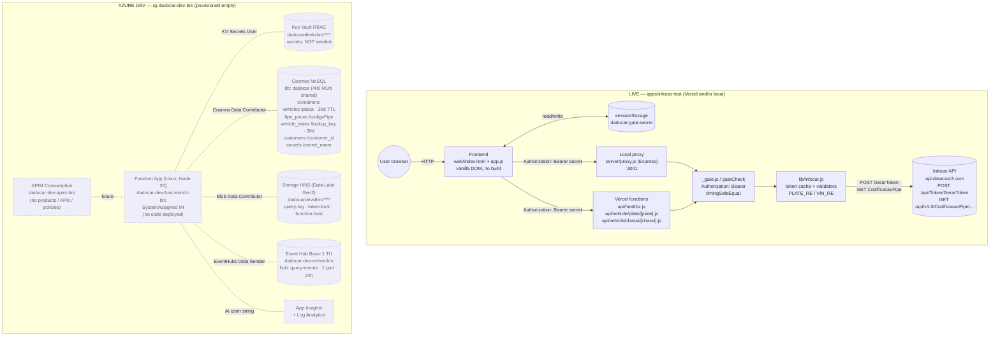
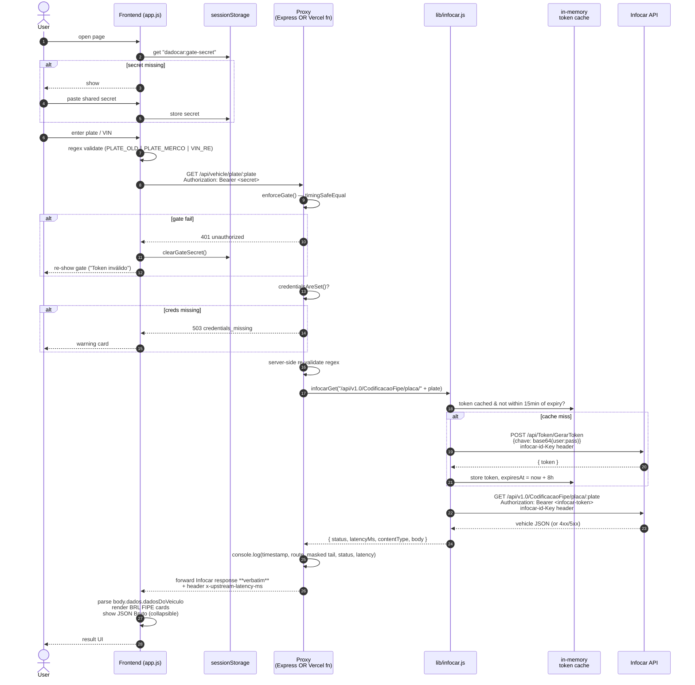
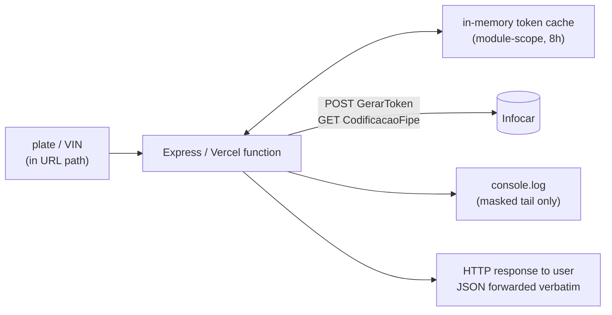
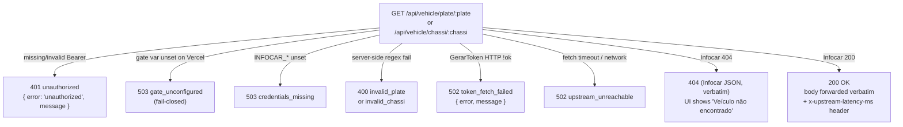
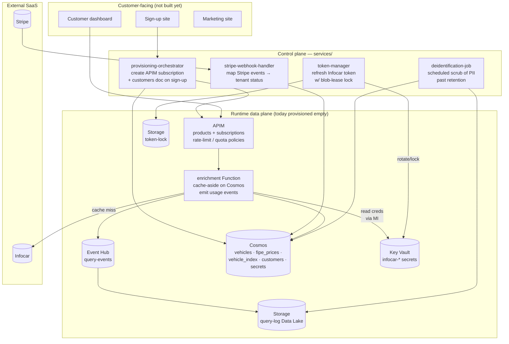

# Dadocar — Architecture, Flows & Future Integrations

Project: **Dadocar** — a vehicle‑data API platform that resells Infocar's FIPE pricing API with a caching, billing and analytics layer on top.

At MVP the repo is split into **two independent halves**:

1. **`apps/infocar-test/`** — a *live* tool (local Express + Vercel serverless) that talks to Infocar end‑to‑end, with no Azure involvement. This is what currently produces real requests/responses.
2. **`infrastructure/`** — the **DEV** Azure environment, provisioned by Bicep but **deployed empty** (no application code yet). `services/*` are `.gitkeep` placeholders.

All diagrams below are Mermaid; they render natively on GitHub and in most Markdown viewers.

---

## 1. High‑level architecture (current state)



Legend: dashed boxes inside the Azure subgraph indicate resources that are provisioned but contain **no application code or data** yet — that's the MVP scope as called out in `README.md` § "MVP scope" and `docs/dev-setup.md` § 10.

---

## 2. Request flow — current MVP (plate / chassi lookup)

Both the local Express proxy (`server/proxy.js`) and the Vercel function (`api/vehicle/plate/[plate].js`) execute the *same logic*, sharing `lib/infocar.js`.



Key implementation details worth keeping in mind when reading the sequence:

- **Verbatim forwarding.** `infocarGet()` returns the raw body string and the proxy does `res.status(out.status).type(out.contentType).send(out.body)` — *no field stripping*. That's the explicit point of the test app.
- **Token cache is per-process / per-warm-invocation.** Cold Vercel starts re-fetch the token; that's documented as acceptable because `GerarToken` is idempotent and cheap.
- **Token TTL = 8h, refreshed 15 min early.** Constants `TOKEN_TTL_MS` and `TOKEN_REFRESH_MARGIN` in `lib/infocar.js`.
- **Fetch timeout is 20 s** (`FETCH_TIMEOUT_MS`) — both for the token call and the lookup; an abort produces a `502 upstream_unreachable`.

---

## 3. Data flow

### 3a. Today — no persistence



Nothing persists between requests except the in-memory bearer token. Logs only ever see `EFS…` (first 3 characters + `***`) thanks to `maskTail()`.

### 3b. Tomorrow — Azure data path the empty resources are shaped for

```mermaid
flowchart LR
  CLI["Customer client<br/>API key in header"]
  APIM2["APIM<br/>product · subscription key<br/>rate-limit / quota policies"]
  FN2["Function App<br/>(enrichment-orchestrator)"]
  KV2[("Key Vault<br/>infocar-id-key<br/>infocar-username<br/>infocar-password")]
  VI[("Cosmos<br/>vehicle_index<br/>/lookup_key · 30d TTL")]
  VE[("Cosmos<br/>vehicles<br/>/placa · 30d TTL")]
  FP[("Cosmos<br/>fipe_prices<br/>/codigoFipe · ∞ TTL")]
  CUST[("Cosmos<br/>customers<br/>/customer_id · ∞ TTL")]
  TL[("Storage container<br/>token-lock<br/>(blob lease)")]
  EH2[("Event Hub<br/>query-events · 24h")]
  QL[("Storage Data Lake<br/>query-log/<br/>partitioned archive")]
  INF2[(Infocar)]

  CLI --> APIM2 -->|JWT/key validated| FN2
  FN2 -->|customer lookup| CUST
  FN2 -->|cache lookup| VI
  VI -- hit --> FN2
  VI -- miss --> FN2
  FN2 -->|secrets (MI)| KV2
  FN2 -->|lease| TL
  FN2 -->|on miss<br/>POST/GET| INF2
  INF2 --> FN2
  FN2 -->|upsert| VE
  FN2 -->|upsert prices| FP
  FN2 -->|emit usage event| EH2
  EH2 -->|capture / consumer fn| QL
  FN2 --> CLI
```

The shape of each Cosmos container in `modules/cosmos.bicep` makes the intended access pattern unambiguous:

| Container | Partition key | TTL | Role |
|---|---|---|---|
| `vehicles` | `/placa` | 30 d | Cache of full Infocar payload keyed by plate |
| `fipe_prices` | `/codigoFipe` | ∞ (manual) | Reference table of FIPE codes/prices, refreshed by job |
| `vehicle_index` | `/lookup_key` | 30 d | Generic lookup → `placa` mapping (e.g. VIN → placa) |
| `customers` | `/customer_id` | ∞ | Tenant record: plan, status, APIM subscription, Stripe ids |
| `secrets` | `/secret_name` | ∞ | App-managed secret metadata / per-tenant key hashes |

---

## 4. Responses

The proxy is designed so that **the frontend can route on `status` + `body.error`** without ever inspecting Infocar's raw error formats.



### Healthz envelope
```jsonc
GET /api/healthz                       // gate-enforced
200 → { ok: true, credentials_set: true|false, gate_enforced: true|false }
```

### 200 OK — body shape the frontend depends on
Inspected in `web/app.js` → `renderResult()`:
```jsonc
{
  "dados": {
    "dadosDoVeiculo": { /* k/v pairs → rendered into Dados grid */ },
    /* FIPE-related fields are parsed for BRL formatting */
    ...
  }
}
```
The raw payload is always shown verbatim inside the `JSON Bruto` collapsible panel — the proxy never reshapes it.

### Error envelope (proxy-generated)
```jsonc
{ "error": "<machine_code>", "message": "<human readable, sometimes PT-BR>" }
```
The frontend has explicit branches for `unauthorized`, `credentials_missing`, `invalid_plate`, `invalid_chassi`, generic non-2xx, and network failure.

---

## 5. Future integrations

The empty `services/*` folders and the empty Azure resources are not arbitrary — they map one-to-one to a planned commercial topology.



### Roadmap mapping — placeholder → capability → trigger

| Folder / resource (today empty) | Capability it will own | Trigger / binding |
|---|---|---|
| `services/token-manager/` | Centralised Infocar token refresh, with a blob-lease lock in the `token-lock` container so only one instance refreshes at a time | Timer + on-demand call from the enrichment Function |
| `services/provisioning-orchestrator/` | On new tenant sign-up: create APIM product subscription, write `customers/{customer_id}` doc, optionally seed per-tenant secrets | HTTP from sign-up site **or** Stripe `checkout.session.completed` |
| `services/stripe-webhook-handler/` | Translate Stripe webhooks (`invoice.paid`, `customer.subscription.deleted`, `customer.subscription.updated`, dunning) into tenant status changes in Cosmos `customers` | Stripe webhook HTTP, signature verified |
| `services/deidentification-job/` | Scheduled PII scrub: remove plate/VIN/contact fields from `query-log` Data Lake partitions and from Cosmos `vehicles` past retention | Timer trigger |
| `services/provisioning-orchestrator/` (continued) | Generate per-tenant API keys (APIM subscription keys), email the customer | After APIM subscription create |
| Enrichment Function | Paid `/v1/vehicle/...` endpoint: cache-aside on `vehicles`/`vehicle_index`, fall back to Infocar via `token-manager`, write back, emit Event Hub event | HTTP **through APIM** |
| APIM (empty today) | Productise the API: OpenAPI import, subscription keys, rate-limit / quota policies, developer portal, optional JWT validation | — |
| Event Hub `query-events` | Decoupled stream of usage events for billing & analytics; 24 h retention → Capture / consumer to `query-log` | Function output binding |
| Cosmos `secrets` | App-managed secret metadata (per-tenant key hashes, rotation timestamps) — distinct from Key Vault secrets which hold *Infocar's* credentials | Provisioning orchestrator, token manager |
| Cosmos `customers` | Source of truth for tenant: plan, status, Stripe customer/subscription IDs, APIM subscription id | Provisioning orchestrator + stripe-webhook-handler |
| Production environment | `prod.bicepparam` exists as a placeholder; no script deploys to prod today | Activated when MVP graduates |
| CI/CD | Currently zero; deploys are manual via `infrastructure/scripts/deploy-dev.sh` / `destroy-dev.sh` | GitHub Actions (or similar) to be added |

### Identity & secrets — already wired

These are the role grants that already exist in the empty environment and that the future code will rely on (from `modules/*.bicep`):

| Role | Assignee | Scope |
|---|---|---|
| Key Vault Secrets Officer | deployer Service Principal | Key Vault — so `az keyvault secret set` works without re-running Bicep |
| Key Vault Secrets User | Function App MI | Key Vault — runtime read of `infocar-*` |
| Cosmos DB Built-in Data Contributor | Function App MI | Cosmos account — data plane only (local auth keys are *disabled*) |
| Storage Blob Data Contributor | Function App MI | Storage account — `query-log`, `token-lock`, `function-host` |
| Azure Event Hubs Data Sender | Function App MI | Event Hub namespace |

So when application code arrives, no further role plumbing is needed; only the Infocar secrets need to be seeded (`az keyvault secret set …` per `docs/dev-setup.md` § 6).

---

## 6. Out-of-scope today (explicit)

From `README.md` and `docs/dev-setup.md` § 10:

- Any application code in `services/*`.
- Customer-facing apps (sign-up, dashboard, marketing).
- Stripe integration (no webhook handler, no product mapping).
- APIM products, subscriptions, OpenAPI specs, policies — APIM is provisioned **empty**.
- Production environment — `prod.bicepparam` is a placeholder; no script deploys to prod.
- CI/CD pipelines.
- Cross-region failover / zone redundancy in dev — Cosmos is single-region, Event Hub Basic, no AZ.
